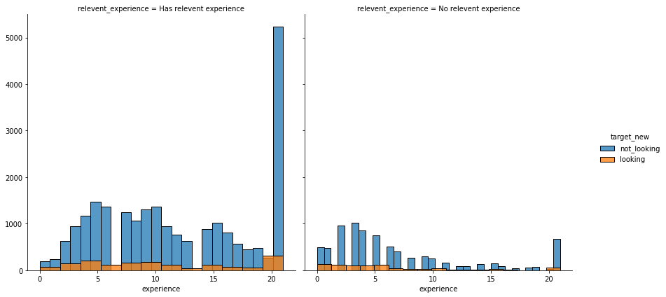

# Who is looking for a new job?

 

A company which is active in Big Data and Data Science wants to hire data scientists among people who successfully pass some courses which are conducted by the company. A large number of candidates signup for their training. To reduce the cost and time, as well as the quality of the training, the company wants to know which of these candidates really wants to work for them, or are most likely to look for a job, after completing the training.

 

Information related to demographics, education, experience and features related to training as well are in hands. In total 33.380 enrollees participated in the training while 25% of them where actually looking for a new job. The dataset can be found here [kaggle](https://www.kaggle.com/arashnic/hr-analytics-job-change-of-data-scientists?select=aug_train.csv). We will use the given information to analyse the employees and see who is looking for a job change. 

 

## Do experienced people tend to look for a new job?

 

One might assume that people with no relevant experience participate in the training with a job change in mind. Why else participate, right? 

Most enrollee have relevant experience in the field. Among those with relevant experience, 7% are looking for a new job. While among those with no relevant experience, 10% are looking for a new job. Hence, we see that the difference is not as big as one might assume! 

 

What about the amount of experience? Are participians with a short term work experience more likely to look for a new job? 

 

## Does the educational background matter? 

 

## Do experienced people tend to look for a new job?

