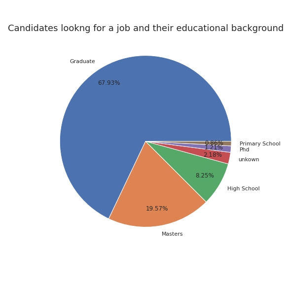

# Who is looking for a new job?

A company which is active in Data Science wants to hire data scientists among people who successfully pass training courses which are conducted by the company. A large number of candidates signup for their training. To reduce the cost and time, as well as the quality of the training, the company wants to know which of these candidates really want to work for them, or are most likely to look for a job, after completing the training.

Information related to demographics, education, experience and features related to training as well are in hands. The dataset can be found here [Kaggle](https://www.kaggle.com/arashnic/hr-analytics-job-change-of-data-scientists?select=aug_train.csv). We will use the given information to analyse the enrollees and see who is looking for a job change. 

In total 33.380 enrollees participated in the training, most of them beeing male. Around 25% people are lookging for a job change. 

## Do experienced people tend to look for a new job?

One might assume that people with no relevant experience in the field of data science participate in the training with a job change in mind. 

Most candidates have relevant experience in the field. Among those with relevant experience, 15.5% are looking for a new job. While among those with no relevant experience, 9.5% are looking for a new job. Hence, we see that the difference is not as big as one might assume. 

## Does the educational background matter? 
Let us have a look at the educational background of the candidates looking for a new job.

We see that majority are Graduates. They have successfully completed a course of study or training and are ready to work. Let's dig a little bit deeper and have a look at the major disciplines of the participants looking for a job. 

It comes to no suprise that most people, or around 80%, who are looking for new job are STEM degree holders. Thus it is possible that they are more likely to be candidates for a job at the company.  

## Did candidates work before joining the training? 

It is intersting to see if people who had a recent job change are likely to seek again a new job. 

Almost half of the people who are looking out for job change have only one year difference between their current job and previous job. This looks a bit odd. To investigate this information further, we can have a look at the amount of experience of the candidates both for all who are looking for a job and for those who have one year difference between their jobs.

From these plots we see similar distributions. Most candidates who are looking for a job have 2-5 and +20 years experience. So perhaps the candidates who had only one year difference between their jobs where unhappy where they worked and thus changed the company. 

## What is the City Development Index? Does it matter here?
The City Development Index (CDI) was developed for the Second United Nations Conference on Human Settlements (Habitat II) and measures the level of development in cities. 

 Average CDI for people who are looking for job change is less. Hence, people from cities with an higher development index are less likely to look for job change. A reason for that might be that cities with a low CDI have less job opportunity. This observation is also confirmed when looking at the correlation between the target variable and the CDI variable which is -0.342- 

 ## Conclusion

Looking at the above numbers and plots, the candidates who are most likley to look for a new job: 
- have relevant experience,
- are graduates with STEM as major discipline,
- come from cities with a low CDI ,
- have had a job change within a year.
