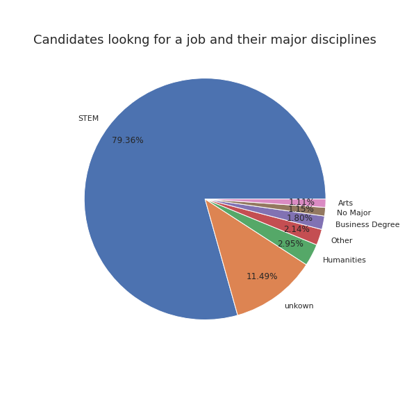
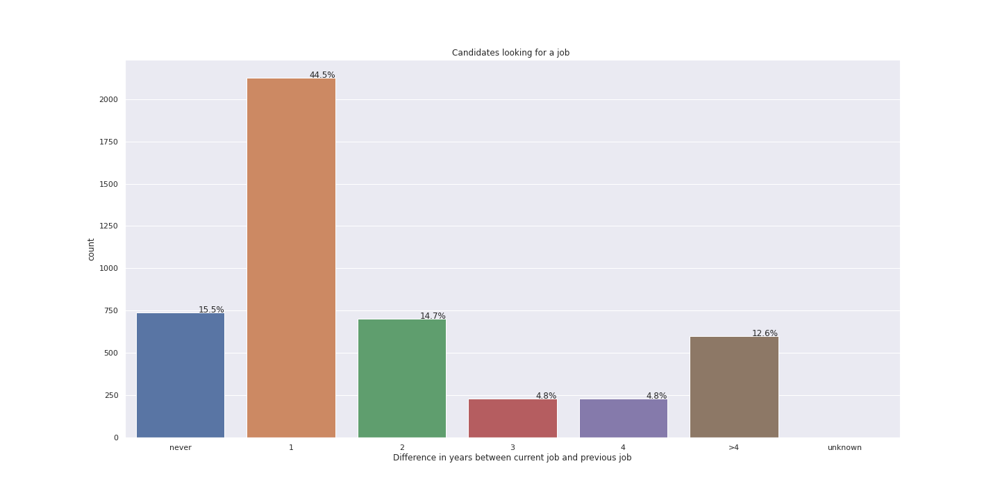

# Who is looking for a new job?

A company which is active in Data Science wants to hire data scientists among people who successfully pass training courses which are conducted by the company. A large number of candidates signup for their training. To reduce the cost and time, as well as the quality of the training, the company wants to know which of these candidates really want to work for them, or are most likely to look for a job, after completing the training.

 

Information related to demographics, education, experience and features related to training as well are in hands. The dataset can be found here [Kaggle](https://www.kaggle.com/arashnic/hr-analytics-job-change-of-data-scientists?select=aug_train.csv). We will use the given information to analyse the enrollees and see who is looking for a job change. 

In total 33.380 enrollees participated in the training, most of them beeing male. Around 25% people are lookging for a job change. 

## Do experienced people tend to look for a new job?

One might assume that people with no relevant experience in the field of data science participate in the training with a job change in mind. 

Most candidates have relevant experience in the field. Among those with relevant experience, 15.5% are looking for a new job. While among those with no relevant experience, 9.5% are looking for a new job. Hence, we see that the difference is not as big as one might assume. 

## Does the educational background matter? 

Among the enrolles who are looking for a new job, it is not a suprise that most of them are Graduates. They have successfully completed a course of study or training and are ready to work.

 

Let's dig a little bit deeper and have a look at the major disciplines of the participants looking for a job. 

It comes to no suprise that most people, or around 80%, who are looking for new job are STEM degree holders. Thus it is possible that they are more likely to be candidates for a job at the company.  

## Did candidates work before joining the training? 

Since Graduates are most likley to look for a job opportunity, we might expect that the most likely candidates open to a new job are the ones having no work experience. It is intersting to see if people who had a recent job change are likely to seek a new job. 

Almost half of the people who are looking out for job change have only one year of difference between their current job and previus job. Perhaps they where not happy where they worked. Or perhaps the company they worked at, where not happy with them and thus the participate at the training course to improve.
